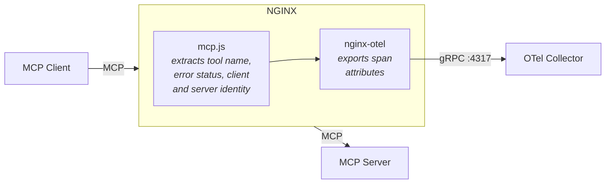

[](https://www.repostatus.org/#concept)
[](https://securityscorecards.dev/viewer/?uri=github.com/xeioex/nginx-mcp-js)
[](/SUPPORT.md) <!-- [](<Insert URL>) -->
[](https://community.nginx.org)
[](https://opensource.org/license/apache-2-0)
[](/CODE_OF_CONDUCT.md)

# MCP Observability with NGINX

An [njs](https://nginx.org/en/docs/njs/) module for monitoring
[Model Context Protocol](https://modelcontextprotocol.io/) (MCP) traffic
through NGINX.  When combined with
[nginx-otel](https://github.com/nginxinc/nginx-otel), it extracts MCP metadata
from JSON-RPC/SSE responses in real time and exports it as OpenTelemetry span
attributes -- giving you per-tool latency, throughput, and error-rate visibility
without any changes to the MCP client or server.

## How it works



NGINX sits as a reverse proxy between an MCP client and server.  The njs body
filter (`mcp.js`) inspects the streamed
[Streamable HTTP](https://modelcontextprotocol.io/specification/2025-03-26/basic/transports#streamable-http)
SSE response, parses the first JSON-RPC 2.0 message, and extracts:

- **`mcp_tool_name`** -- the tool name from `tools/call` requests
  (read from the request body)
- **`mcp_tool_status`** -- `"ok"` or `"error"`, detected from both
  protocol-level JSON-RPC `error` objects and tool-level `isError: true`
  responses
- **`mcp_client_name`** -- the MCP client identity (`clientInfo.name`)
  captured from the `initialize` handshake and associated with the session
  via
  [`js_shared_dict_zone`](https://nginx.org/en/docs/http/ngx_http_js_module.html#js_shared_dict_zone)
- **`mcp_server_name`** -- the MCP server identity (`serverInfo.name`)
  extracted from the `initialize` response body and stored in a separate
  shared dict zone

These values are exposed as NGINX variables that the nginx-otel module can
attach to each trace span as custom attributes.

## Setup

### Prerequisites

- NGINX JavaScript [njs](https://github.com/nginx/njs) module
- The [nginx-otel](https://github.com/nginxinc/nginx-otel) module
- An OpenTelemetry Collector (or compatible backend) to receive traces

### Configuration

Copy `mcp.js` to your NGINX configuration directory (e.g. `/etc/nginx/`) and
add the following to your `nginx.conf`:

```nginx
load_module modules/ngx_http_js_module.so;
load_module modules/ngx_otel_module.so;

events {}

http {
    js_import main from mcp.js;
    js_shared_dict_zone zone=mcp_clients:1M timeout=300s evict;
    js_shared_dict_zone zone=mcp_servers:1M timeout=300s evict;

    otel_exporter {
        endpoint localhost:4317;
    }

    server {
        listen 9000;

        otel_trace on;

        # Extract MCP metadata from request/response
        js_set $mcp_tool main.mcp_tool_name;
        js_set $mcp_status main.mcp_tool_status;
        js_set $mcp_client main.mcp_client_name;
        js_set $mcp_server main.mcp_server_name;

        # Export as span attributes
        otel_span_attr "mcp.tool.name" $mcp_tool;
        otel_span_attr "mcp.tool.status" $mcp_status;
        otel_span_attr "mcp.client.name" $mcp_client;
        otel_span_attr "mcp.server.name" $mcp_server;

        location /mcp {
            # Parse SSE response, capture client and server identity
            js_header_filter main.mcp_header_filter;
            js_body_filter main.mcp_response_filter;

            proxy_pass http://upstream_mcp_server;
        }
    }
}
```

The `otel_exporter` block points to your OpenTelemetry Collector's gRPC
endpoint.  Each proxied request produces a trace span with the `mcp.tool.name`,
`mcp.tool.status`, `mcp.client.name`, and `mcp.server.name` attributes, which downstream
tools (Prometheus, Grafana, Jaeger, etc.) can use for filtering, grouping, and
alerting.

Two `js_shared_dict_zone` directives create shared memory zones that store
session-to-identity mappings.  During the `initialize` handshake the header
filter captures `clientInfo.name` from the request body, and the body filter
extracts `serverInfo.name` from the response.  Both are keyed by
`Mcp-Session-Id` and looked up on subsequent `tools/call` requests.

### Exported variables

| Variable | Directive | Description |
|----------|-----------|-------------|
| `$mcp_tool` | `js_set` | Tool name from `tools/call` requests, empty for other methods |
| `$mcp_status` | `js_set` | `"ok"` or `"error"` based on the JSON-RPC response |
| `$mcp_client` | `js_set` | Client name from `initialize` handshake, looked up by session ID |
| `$mcp_server` | `js_set` | Server name from `initialize` response, looked up by session ID |

### njs functions

| Function | Used as | Description |
|----------|---------|-------------|
| `mcp_tool_name` | `js_set` | Parses request body, returns tool name for `tools/call` |
| `mcp_tool_status` | `js_set` | Returns `"error"` if response contains a JSON-RPC error or `isError: true` |
| `mcp_client_name` | `js_set` | Looks up client name by `Mcp-Session-Id` from shared dict |
| `mcp_server_name` | `js_set` | Looks up server name by `Mcp-Session-Id` from shared dict |
| `mcp_response_filter` | `js_body_filter` | Buffers SSE response, extracts first JSON-RPC message and server identity |
| `mcp_header_filter` | `js_header_filter` | Removes `Content-Length` header and captures client identity from `initialize` |

## Demo

A complete end-to-end demo is available in the [`demo/`](demo/) directory.
It packages NGINX, njs, nginx-otel, an OTel Collector, Prometheus, Grafana,
and a mock MCP client/server into a single Docker image with a pre-provisioned
dashboard.  See [demo/README.md](demo/README.md) for instructions.

## Contributing

Please see the [contributing guide](/CONTRIBUTING.md) for guidelines on how to
best contribute to this project.

## License

[Apache License, Version 2.0](/LICENSE)

&copy; [F5, Inc.](https://www.f5.com/) 2025
