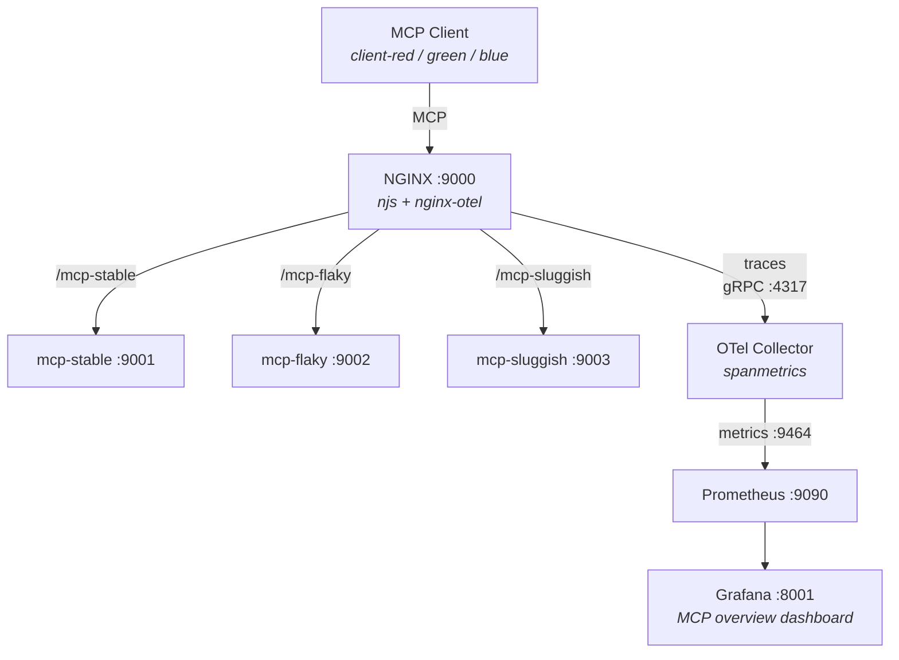

# MCP Observability Demo

A self-contained Docker demo of the MCP observability setup described in the
[root README](../README.md).  One command builds it, one command runs it, and a
pre-provisioned Grafana dashboard shows live per-tool metrics within minutes.

## Architecture



## Components

| Component | Role | Source |
|-----------|------|--------|
| [NGINX](https://github.com/nginx/nginx) | Reverse proxy between MCP client and server | `nginx:alpine-otel` image |
| [njs](https://github.com/nginx/njs) | JavaScript module that parses SSE/JSON-RPC responses to extract tool names and error status | Pre-installed in base image |
| [nginx-otel](https://github.com/nginxinc/nginx-otel) | NGINX dynamic module that exports OpenTelemetry traces with custom span attributes | Pre-installed in base image |
| [OTel Collector Contrib](https://github.com/open-telemetry/opentelemetry-collector-contrib) | Receives traces, converts spans to metrics via the spanmetrics connector, exposes a Prometheus endpoint | Pre-built binary |
| [Prometheus](https://github.com/prometheus/prometheus) | Scrapes span-derived metrics from the OTel Collector | Pre-built binary |
| [Grafana](https://github.com/grafana/grafana) | Visualizes metrics in a pre-provisioned dashboard | Pre-built binary |
| MCP Server (Go) | Mock [Streamable HTTP](https://modelcontextprotocol.io/specification/2025-03-26/basic/transports#streamable-http) server with 8 tools and configurable error/latency injection; three instances run with different profiles (stable, flaky, sluggish) | `mcp/mcp_server.go` |
| MCP Client (Go) | Traffic generator with three client identities (red, green, blue) in a 1:2:3 weight distribution, each targeting a different server | `mcp/mcp_client.go` |

Both Go programs use the official
[MCP Go SDK](https://github.com/modelcontextprotocol/go-sdk).

### Server profiles

| Server | Port | Behavior |
|--------|------|----------|
| mcp-stable | 9001 | No errors, base latency (`--max-latency 50ms`) |
| mcp-flaky | 9002 | ~2% protocol errors, ~10% tool errors, base latency |
| mcp-sluggish | 9003 | No errors, elevated latency (`--max-latency 100ms`) |

`query_db` and `resize_image` use 5x and 3x the base `--max-latency`
respectively, so they are noticeably slower on the sluggish server
(up to 500ms and 300ms).

### Client profiles

| Client | Weight | Target |
|--------|--------|--------|
| client-red | 1 | mcp-stable |
| client-green | 2 | mcp-flaky |
| client-blue | 3 | mcp-sluggish |

## Quick start

### Prerequisites

- [Docker](https://docs.docker.com/get-docker/) (with BuildKit)

### Build

From the **repository root**:

```bash
docker build -f demo/Dockerfile -t mcp-demo .
```

The image is built in two stages: Go binaries are compiled from source while
NGINX with njs and otel modules comes from the official `nginx:alpine-otel`
image.  OTel Collector, Prometheus, and Grafana binaries are downloaded at build
time.

### Run

```bash
docker run -p 8001:8001 mcp-demo
```

On startup the container launches three MCP server instances, NGINX, the
telemetry stack, and a traffic generator with 6 concurrent workers.  Status
lines show per-client counters (red/green/blue):

```
Requests: (12/25/38) | Errors: (0/3/0) | RPS: (12/24/37)
```

### View the dashboard

1. **Wait 2-3 minutes** after starting the container.  Prometheus scrapes
   metrics every 5 seconds, but the Grafana dashboard queries use `rate()` over
   a 5-minute window, so the panels need a few minutes of accumulated data
   before meaningful graphs appear.

2. Open **http://localhost:8001** in your browser.

3. Log in with username `admin` and password `admin` (skip the password change
   prompt).

4. Navigate to **Dashboards** and open the **MCP overview** dashboard.

5. The dashboard has nine panels in a 3x3 grid:

   |  | per tool | per client | per server |
   |--|----------|------------|------------|
   | **P99 response time** | by tool name | by client identity | by server identity |
   | **RPS** | by tool name | by client identity | by server identity |
   | **Error rate** | by tool name | by client identity | by server identity |

   `query_db` and `resize_image` have intentionally higher latency (5x and 3x
   the base `--max-latency`).  Errors are concentrated on the flaky server
   (~10% tool error rate).

## File layout

```
demo/
├── Dockerfile                          # 2-stage build
├── entrypoint.sh                       # Starts all services
├── nginx/
│   └── mcp.conf                        # NGINX config (proxy + otel + njs)
├── mcp/
│   ├── mcp_server.go                   # Mock MCP server (8 tools, 3 instances)
│   ├── mcp_client.go                   # Traffic generator (3 client identities)
│   ├── go.mod
│   └── go.sum
├── otel/
│   └── config.yaml                     # OTel Collector: OTLP -> spanmetrics -> Prometheus
├── prometheus/
│   └── prometheus.yaml                 # Scrape config
└── grafana/
    └── provisioning/
        ├── datasources/
        │   └── prometheus.yaml         # Auto-provisioned datasource
        └── dashboards/
            ├── dashboards.yaml         # Dashboard provisioning config
            └── mcp-overview.json       # Pre-built dashboard (9 panels)
```

The njs module itself (`mcp.js`) lives at the repository root.
