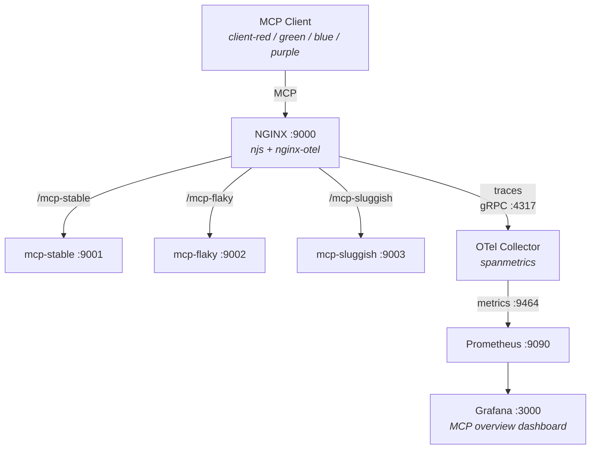

# Agentic Observability Demo

A Docker Compose demo of the MCP observability setup described in the
[root README](../README.md). Uses standard containers from DockerHub for all
components, with a pre-provisioned Grafana dashboard showing live per-tool
metrics within minutes.

## Architecture



## Components

| Component | Role | Source |
|-----------|------|--------|
| [NGINX](https://github.com/nginx/nginx) | Reverse proxy between MCP client and server | `nginx:alpine-otel` from DockerHub |
| [njs](https://github.com/nginx/njs) | JavaScript module that parses SSE/JSON-RPC responses to extract tool names and error status | Pre-installed in NGINX image |
| [nginx-otel](https://github.com/nginxinc/nginx-otel) | NGINX dynamic module that exports OpenTelemetry traces with custom span attributes | Pre-installed in NGINX image |
| [OTel Collector Contrib](https://github.com/open-telemetry/opentelemetry-collector-contrib) | Receives traces, converts spans to metrics via the spanmetrics connector, exposes a Prometheus endpoint | `otel/opentelemetry-collector-contrib` from DockerHub |
| [Prometheus](https://github.com/prometheus/prometheus) | Scrapes span-derived metrics from the OTel Collector | `prom/prometheus` from DockerHub |
| [Grafana](https://github.com/grafana/grafana) | Visualizes metrics in a pre-provisioned dashboard | `grafana/grafana-oss` from DockerHub |
| MCP Server (Go) | Mock [Streamable HTTP](https://modelcontextprotocol.io/specification/2025-03-26/basic/transports#streamable-http) server with 8 tools and configurable error/latency injection; three instances run with different profiles (stable, flaky, sluggish) | Built from `mcp/mcp_server.go` |
| MCP Client (Go) | Traffic generator with four client identities (red, green, blue, purple) in a 1:2:3:1 weight distribution, each targeting a different server; automatically retries on connection failure | Built from `mcp/mcp_client.go` |

Both Go programs use the official
[MCP Go SDK](https://github.com/modelcontextprotocol/go-sdk).

### Server profiles

| Server | Port | Behavior |
|--------|------|----------|
| mcp-stable | 9001 | No errors, base latency (`--max-latency 50ms`) |
| mcp-flaky | 9002 | ~2% protocol errors, ~10% tool errors, base latency |
| mcp-sluggish | 9003 | No errors, elevated latency (`--max-latency 100ms`) |

`query_db` and `resize_image` use 5x and 3x the base `--max-latency`
respectively, so they are noticeably slower on the sluggish server
(up to 500ms and 300ms).

### Client profiles

| Client | Weight | Target |
|--------|--------|--------|
| client-red | 1 | mcp-stable |
| client-green | 2 | mcp-flaky |
| client-blue | 3 | mcp-sluggish |
| client-purple | 1 | mcp-stable |

## Quick start

### Prerequisites

- [Docker](https://docs.docker.com/get-docker/) with Docker Compose
- [Docker Compose](https://docs.docker.com/compose/install/) (v2.0+)

### Run

From the **demo directory**:

```bash
cd demo
docker compose up --build
```

This will:
1. Build the MCP server/client Go binaries
2. Pull standard images from DockerHub (NGINX, OTel Collector, Prometheus, Grafana)
3. Start all 8 services in separate containers
4. Launch the traffic generator with 6 concurrent workers

The MCP client logs show per-client counters (red/green/blue/purple):

```
Requests: (12/25/38/11) | Errors: (0/3/0/0) | RPS: (12/24/37/11)
```

To stop all services:

```bash
docker compose down
```

### View the dashboard

1. **Wait about 30 seconds** after starting the containers.  Prometheus scrapes
   metrics every 5 seconds and the Grafana dashboard queries use `rate()` over
   a 1-minute window, so the panels populate quickly once traffic starts
   flowing.

2. Open **http://localhost:3000** in your browser.

3. Log in with username `admin` and password `admin` (skip the password change
   prompt).

4. Navigate to **Dashboards** and open the **MCP overview** dashboard.

5. The dashboard has nine panels in a 3x3 grid:

   |  | per tool | per client | per server |
   |--|----------|------------|------------|
   | **P99 response time** | by tool name | by client identity | by server identity |
   | **RPS** | by tool name | by client identity | by server identity |
   | **Error rate** | by tool name | by client identity | by server identity |

   `query_db` and `resize_image` have intentionally higher latency (5x and 3x
   the base `--max-latency`).  Errors are concentrated on the flaky server
   (~10% tool error rate).

## File layout

```
demo/
├── docker-compose.yaml                 # Multi-container orchestration
├── nginx/
│   └── mcp.conf                        # NGINX config (proxy + otel + njs)
├── mcp/
│   ├── Dockerfile                      # Builds Go binaries
│   ├── mcp_server.go                   # Mock MCP server (8 tools, 3 instances)
│   ├── mcp_client.go                   # Traffic generator (4 client identities)
│   ├── go.mod
│   └── go.sum
├── otel/
│   └── config.yaml                     # OTel Collector: OTLP -> spanmetrics -> Prometheus
├── prometheus/
│   └── prometheus.yaml                 # Scrape config
└── grafana/
    └── provisioning/
        ├── datasources/
        │   └── prometheus.yaml         # Auto-provisioned datasource
        └── dashboards/
            ├── dashboards.yaml         # Dashboard provisioning config
            └── mcp-overview.json       # Pre-built dashboard (9 panels)
```

The njs module itself (`mcp.js`) lives at the repository root.

## Services

The Docker Compose setup runs 8 separate containers:

1. **nginx** - Reverse proxy with OpenTelemetry instrumentation
2. **otel-collector** - Receives traces and converts to metrics
3. **prometheus** - Metrics storage and querying
4. **grafana** - Dashboard visualization
5. **mcp-stable** - MCP server with no errors
6. **mcp-flaky** - MCP server with ~10% error rate
7. **mcp-sluggish** - MCP server with elevated latency
8. **mcp-client** - Traffic generator

All services communicate over a shared Docker network (`mcp-network`).
